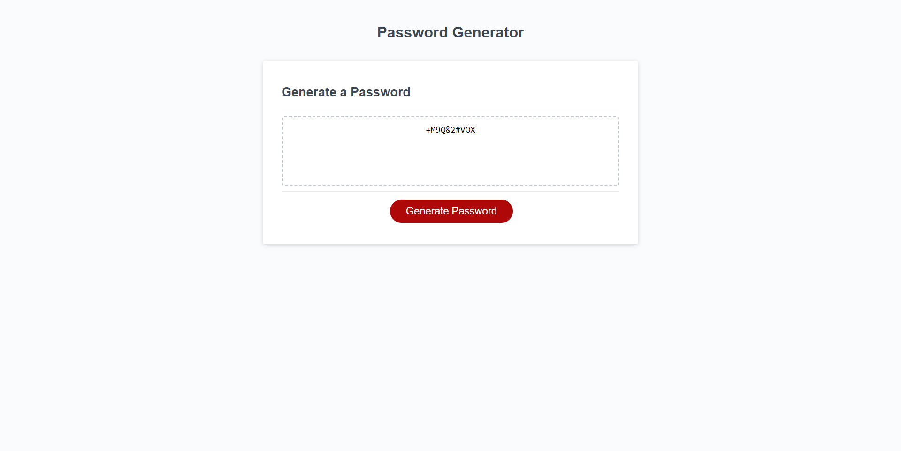

# JavaScript: Password Generator.
### Welcome to my random password generator ,This projects main goal was for practice in JavaScript.

## How to Use.
### You can generate a password by clicking generate password button and following the on-screen prompts.

## Credits.
### Credit to BCS for all the provided extra study material helped finding the information.
### MDN Web Docs: https://developer.mozilla.org/en-US/docs/Web/JavaScript/Data_structures

## Project.
this is a picture displaying the finished project page.
 
link to project:

link to GitHub Repo: